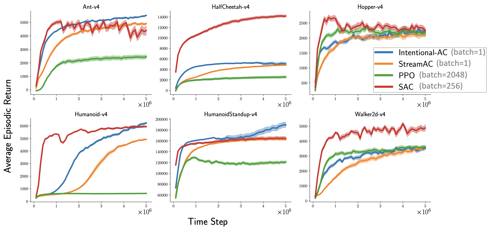

# Intentional Updates for Streaming Reinforcement Learning

Official implementation of the ICML 2026 paper:

> **Intentional Updates for Streaming Reinforcement Learning**
> A. Sharifnassab, M. Elsayed, K. De Asis, A. R. Mahmood, R. S. Sutton
> [[Paper]](https://arxiv.org/pdf/2604.19033) · [[Code]](https://github.com/sharifnassab/Intentional_RL)

---

## Overview

Standard gradient-based RL uses a step size in *parameter* units, which gives no guarantee of a predictable per-step change in function output. In the streaming setting (batch size = 1, no replay), this causes instability because update magnitudes can swing arbitrarily.

**Intentional updates** specify the *intended outcome* of each update in functional units, then solve for the step size that achieves it:

- **Intentional TD / Q-learning** targets a fixed fractional reduction of the TD error per step.
- **Intentional Policy Gradient** targets a bounded per-step change in the sampled action's log-probability — a streaming proxy for limiting local KL divergence.

Both are combined with eligibility traces and RMSProp-style diagonal scaling. A single hyperparameter setting transfers across all tasks within each benchmark family without per-environment tuning. One SAC update costs ~140× the FLOPs of one Intentional-AC update.

## Results

<p align="center">
  
  <br><em>MuJoCo: Intentional-AC vs StreamAC (streaming baseline), PPO, and SAC — 30 seeds, 95% confidence intervals.</em>
</p>

Full results across DM Control, MinAtar, and Atari are in the paper.

## Installation

```bash
python -m venv .venv
source .venv/bin/activate
pip install -r requirements.txt
```

## Usage

```bash
# Continuous control (MuJoCo / DM Control)
python intentional_ac.py --env_name HalfCheetah-v4 --seed 0 --debug

# MinAtar
python intentional_q_minatar.py --env_name MinAtar/Breakout-v1 --seed 0 --debug

# Atari
python intentional_q_atari.py --env_name BreakoutNoFrameskip-v4 --seed 0 --debug
```

Add `--render` to visualise the agent live. Add `--debug` to print episodic returns during training.

### Key hyperparameters

| Flag | Default | Meaning |
|------|---------|---------|
| `--eta_value` | 0.5 | Fraction of TD error to close per critic update |
| `--eta_policy` | 0.05 | Target per-step change in log π (≈5% policy shift per update) |
| `--lamda` | 0.8 | Eligibility trace decay λ |
| `--gamma` | 0.99 | Discount factor |
| `--entropy_coeff` | 0.01 | Entropy bonus coefficient (AC only) |
| `--total_steps` | 5 000 000 | Total environment steps |

### Reproducing paper runs

```bash
for seed in $(seq 0 29); do
  python intentional_ac.py --env_name HalfCheetah-v4 --seed "$seed"
done

python plot.py \
  --data_dir data_intentional_ac_HalfCheetah-v4_gamma0.99_lamda0.8_entropy_coeff0.01_eta_policy0.05_eta_value0.5 \
  --int_space 50000 \
  --total_steps 5000000
```

## Citation

```bibtex
@inproceedings{sharifnassab2026intentional,
  title     = {Intentional Updates for Streaming Reinforcement Learning},
  author    = {Sharifnassab, Arsalan and Elsayed, Mohamed and De Asis, Kris and Mahmood, A. Rupam and Sutton, Richard S.},
  booktitle = {Proceedings of the 43rd International Conference on Machine Learning},
  series    = {Proceedings of Machine Learning Research},
  volume    = {306},
  year      = {2026},
  publisher = {PMLR}
}
```
